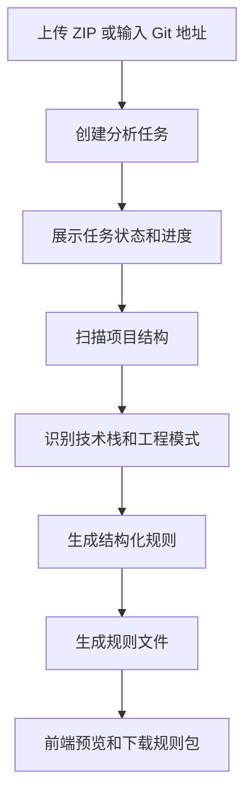

# Asgis AI 工程规范分析助手

Asgis AI 是一个面向前端工程的 AI Coding Rules 生成平台。系统支持上传 ZIP 项目或输入 Git 仓库地址，自动扫描 Vue、React、uni-app、小程序等项目的工程结构，识别 API 调用、组件封装、状态管理、页面目录、hooks/composables、权限逻辑和工程组织方式，并生成可用于 Cursor / Cline 的规则文件。

当前版本聚焦第一阶段 MVP：工程规范自动分析与规则生成。不包含 AST 深度分析、Agent 编排、自动改代码、自动 PR 或自动生成业务页面。

## 功能特性

- ZIP 项目上传分析
- GitHub / Gitee HTTPS 仓库导入分析
- 任务状态、阶段和进度追踪
- Vue / React / uni-app / 小程序 / Taro 项目识别
- 技术栈、项目统计和结构化规则展示
- 分析证据文件展示
- 规则文件预览和复制
- 规则包一键下载
- 标准错误码和中文错误提示
- FastAPI 后端与 Vue3 工作台前端

## 规则输出

分析完成后会生成 4 个文件：

| 文件 | 说明 |
| --- | --- |
| `rules.md` | 项目整体工程规范，包括技术栈、API、状态、页面、组件、权限、禁止规则等 |
| `development-flow.md` | AI Coding 开发流程，只引用规范章节，不重复展开规则内容 |
| `.clinerules` | 面向 Cline 的强约束规则 |
| `cursor-rules.md` | 面向 Cursor 的中文规则 |

规则分类固定为 6 类：

- 项目结构规则
- API 调用规则
- 组件封装规则
- 状态管理规则
- 路由与权限规则
- 样式与命名规则

## 技术栈

前端：

- Vue3
- TypeScript
- Element Plus
- Vite
- Axios

后端：

- FastAPI
- Python
- SQLite
- GitPython

AI 预留能力：

- Qwen
- OpenAI SDK compatible mode
- RAG
- ChromaDB

说明：第一阶段规则生成默认使用确定性 Pattern Analysis，不依赖大模型密钥即可运行。

## 系统流程



## 项目结构

```text
backend/
  app/
    main.py
    routes/
      tasks.py
      upload.py
      repo.py
      status.py
      rules.py
    services/
      analysis_task_service.py
      scan_service.py
      repo_service.py
      pattern_analyzer_service.py
      rules_generator_service.py
      project_service.py
      task_db_service.py
      chunk_service.py
      llm_service.py
      prompt_service.py
      rag_service.py
    models/
      task_model.py
      error_model.py
      rule_model.py

frontend/
  src/
    api/
      task.ts
    types/
      task.ts
    utils/
      stageMap.ts
    views/
      HomeView.vue
    components/
      ProjectImportPanel.vue
      TaskProgressPanel.vue
      TechStackPanel.vue
      RulePreviewTabs.vue
      DownloadPanel.vue
```

## 后端本地运行

```bash
cd backend
python -m venv .venv
```

Windows：

```bash
.venv\Scripts\activate
pip install -r requirements.txt
uvicorn app.main:app --reload --host 127.0.0.1 --port 8001
```

Linux / macOS：

```bash
source .venv/bin/activate
pip install -r requirements.txt
uvicorn app.main:app --reload --host 127.0.0.1 --port 8001
```

健康检查：

```bash
curl http://127.0.0.1:8001/health
```

## 前端本地运行

```bash
cd frontend
npm install
npm run dev
```

默认后端地址为：

```text
http://127.0.0.1:8001
```

如需修改后端地址，在 `frontend/.env.production` 或本地环境变量中配置：

```env
VITE_API_BASE_URL=http://127.0.0.1:8001
```

## 前端打包

```bash
cd frontend
npm run build
```

打包产物位于：

```text
frontend/dist
```

如果需要上传到服务器，可以压缩：

```powershell
Compress-Archive -Path dist\* -DestinationPath dist.zip -Force
```

## 生产部署示例

推荐部署方式：

- Nginx 托管前端静态文件
- FastAPI 运行在本机 `127.0.0.1:8001`
- Nginx 反向代理 `/api/` 和 `/health`

Nginx 示例：

```nginx
server {
    listen 80;
    server_name your_server_ip_or_domain;

    root /opt/asgis-ai/frontend/dist;
    index index.html;

    location /api/ {
        proxy_pass http://127.0.0.1:8001/api/;
        proxy_set_header Host $host;
        proxy_set_header X-Real-IP $remote_addr;
        proxy_set_header X-Forwarded-For $proxy_add_x_forwarded_for;
    }

    location /health {
        proxy_pass http://127.0.0.1:8001/health;
        proxy_set_header Host $host;
    }

    location / {
        try_files $uri $uri/ /index.html;
    }
}
```

后端临时后台启动：

```bash
cd /opt/asgis-ai/Asgis-AI/backend
source .venv/bin/activate
nohup uvicorn app.main:app --host 127.0.0.1 --port 8001 > /tmp/asgis-backend.log 2>&1 &
```

建议生产环境后续改为 systemd 托管。

## 统一任务接口

### 上传 ZIP

```http
POST /api/tasks/upload
```

表单字段：

```text
file: 项目 zip 文件
```

返回：

```json
{
  "task_id": "uuid"
}
```

### 提交 Git 仓库

```http
POST /api/tasks/git
```

请求体：

```json
{
  "git_url": "https://gitee.com/org/repo",
  "access_token": "可选，私有仓库 Token"
}
```

返回：

```json
{
  "task_id": "uuid"
}
```

仓库限制：

- 仅支持 `https://github.com`
- 仅支持 `https://gitee.com`
- 禁止 `file://`
- 禁止 `ssh://`
- 禁止 `git@`
- clone 超时时间限制为 90 秒
- 仓库大小限制为 120MB

### 查询任务状态

```http
GET /api/tasks/{task_id}
```

返回：

```json
{
  "task_id": "uuid",
  "status": "running",
  "stage": "scanning",
  "progress": 60,
  "message": "正在扫描项目目录",
  "error_code": null,
  "error_message": null,
  "created_at": "2026-05-18T10:00:00",
  "updated_at": "2026-05-18T10:00:05"
}
```

任务状态：

- `queued`
- `running`
- `success`
- `failed`

任务阶段：

- `uploading`
- `cloning`
- `scanning`
- `analyzing`
- `generating`
- `packaging`
- `done`
- `error`

### 查询分析结果

```http
GET /api/tasks/{task_id}/result
```

返回结构：

```json
{
  "project_id": "uuid",
  "project_name": "demo",
  "source_type": "git",
  "tech_stack": {
    "framework": "Vue3",
    "language": "TypeScript",
    "ui_library": "Element Plus",
    "state_manager": "Pinia",
    "router": "Vue Router",
    "build_tool": "Vite"
  },
  "summary": {
    "total_files": 100,
    "analyzed_files": 100,
    "api_files": 4,
    "component_files": 12,
    "view_files": 8,
    "store_files": 2
  },
  "rules": [],
  "files": {
    "rules_md": "",
    "development_flow_md": "",
    "cline_rules": "",
    "cursor_rules": ""
  },
  "download_url": "/api/tasks/{task_id}/download"
}
```

### 下载规则包

```http
GET /api/tasks/{task_id}/download
```

下载文件名格式：

```text
asgis-rules-{project_name}-{task_id}.zip
```

压缩包内容：

- `rules.md`
- `development-flow.md`
- `.clinerules`
- `cursor-rules.md`

## 标准错误码

后端可预期错误统一返回：

```json
{
  "detail": {
    "code": "INVALID_GIT_URL",
    "message": "Git 仓库地址不合法",
    "suggestion": "请使用 GitHub / Gitee 的 HTTPS 仓库地址。"
  }
}
```

已覆盖错误码：

- `INVALID_GIT_URL`
- `REPO_CLONE_FAILED`
- `REPO_TOO_LARGE`
- `PRIVATE_REPO_DENIED`
- `ZIP_INVALID`
- `ZIP_TOO_LARGE`
- `SCAN_FAILED`
- `NO_SUPPORTED_FILES`
- `ANALYZE_FAILED`
- `RULE_GENERATE_FAILED`
- `PACKAGE_FAILED`
- `TASK_NOT_FOUND`
- `UNKNOWN_ERROR`

## 识别范围

项目类型：

- Vue
- React
- uni-app
- Taro
- 原生小程序

工程模式：

- API：`axios.create`、`request.ts`、`src/api`、`wx.request`、`uni.request`
- 状态管理：Pinia、Vuex、Redux、Zustand、store 目录
- 页面结构：`src/views`、`src/pages`、`app`、`pages`
- 组件封装：`components`、`BaseXxx`、`components/base`
- hooks/composables：`hooks/useXxx`、`composables/useXxx`
- 权限逻辑：`hasPermission`、`permission.ts`、`auth.ts`、路由守卫、登录态
- 工程组织：api、components、views/pages、router、stores、hooks、composables、utils

## 验证流程

1. 启动后端并确认 `/health` 正常。
2. 启动前端或访问部署页面。
3. 上传 ZIP 项目或输入 GitHub / Gitee 仓库地址。
4. 查看任务进度是否从 queued / running 进入 success。
5. 查看技术栈、项目统计和 6 类结构化规则。
6. 预览 4 个规则文件。
7. 下载规则包并确认压缩包包含 4 个文件。

## 当前边界

当前阶段不实现：

- AST 深度分析
- Agent 自动编排
- 自动修改代码
- 自动提交 PR
- 自动生成业务页面
- 复杂数据库和权限系统

这些能力可作为后续阶段扩展，当前版本优先保证规则生成链路稳定、可演示、可部署。
