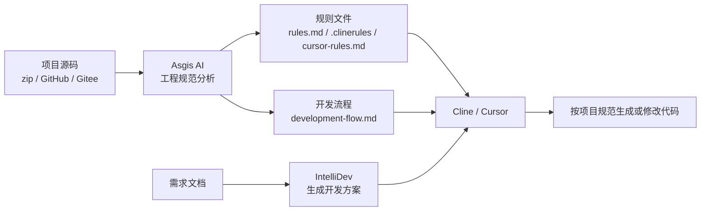
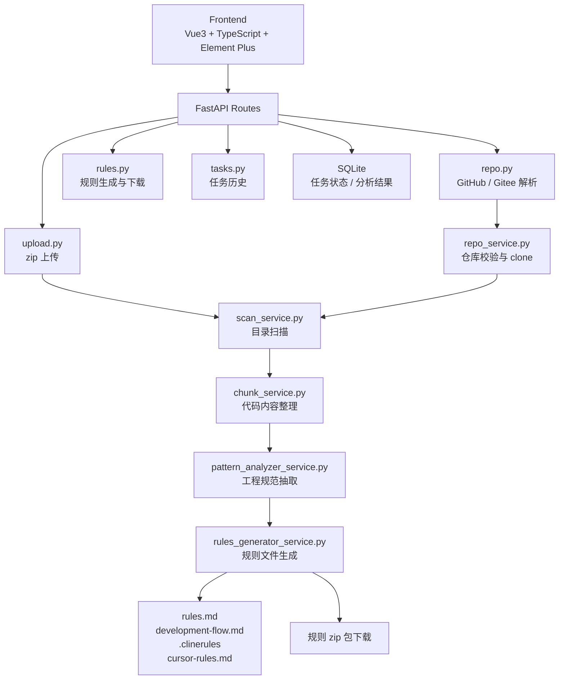

# Asgis AI 工程规范分析助手

Asgis AI 是一个面向前端工程的 AI Coding 规范分析平台。它可以扫描 Vue3、React、小程序、uni-app 等项目，自动抽取 API 调用、组件封装、状态管理、页面结构、hooks/composables、权限逻辑和工程组织方式，并生成可直接给 Cline / Cursor 使用的 AI Coding Rules。

当前 MVP 聚焦一件事：把已有项目的工程规范沉淀成高质量规则文件，让后续 AI 编程工具在开发时先遵守项目规范，再生成代码。

## 项目亮点

- **AI Coding 工程化闭环**：从项目扫描、规范抽取、规则生成，到 Cline / Cursor 约束落地，形成“规范先行”的 AI 开发流程。
- **多技术栈识别**：支持 Vue3、React、原生小程序、Taro、uni-app 项目的工程结构和常见编码模式识别。
- **规则质量增强**：规则输出包含项目技术栈、工程规范、AI Coding Rules、禁止规则和开发流程，避免只生成泛泛而谈的提示词。
- **分析证据可视化**：每类规范都能展示对应来源文件，便于解释“为什么生成这条规则”。
- **任务数据库化**：使用 SQLite 保存分析任务、状态、进度和结果，支持历史任务追踪。
- **一键规则包下载**：一次性导出 `rules.md`、`development-flow.md`、`.clinerules`、`cursor-rules.md`。
- **企业级错误提示**：针对仓库地址、权限、网络、clone 超时、仓库大小等场景返回细化错误码和修复建议。
- **安全仓库解析**：仅支持 GitHub / Gitee HTTPS 地址，禁止 `file://`、`ssh://`、`git@` 等高风险输入。

## AI Coding 落地流程



推荐使用方式：

1. 项目初期先用 Asgis AI 分析已有工程，生成项目级 AI Coding Rules。
2. 新需求进入开发前，用 IntelliDev 解析需求文档并生成开发方案。
3. 将需求文档、开发方案和 Asgis AI 规则交给 Cline / Cursor。
4. AI 编码工具必须根据规则和开发流程执行开发，避免破坏既有工程风格。

## 系统架构



## 核心能力

- zip 项目上传分析
- GitHub / Gitee 仓库地址分析
- 私有仓库 Token 临时 clone，不落库保存
- 分析进度状态展示
- 项目技术栈识别
- 工程规范抽取
- 规则预览、复制和下载
- 规则包一键下载
- 分析证据可视化
- 历史任务查询

## 规则输出

Asgis AI 会生成四类结果：

| 文件                  | 用途                                        |
| --------------------- | ------------------------------------------- |
| `rules.md`            | 完整项目工程规范，适合团队评审和归档        |
| `development-flow.md` | AI 开发流程，只引用规范，不重复展开规范内容 |
| `.clinerules`         | 面向 Cline 的强约束规则                     |
| `cursor-rules.md`     | 面向 Cursor 的中文规则                      |

规则内容包含：

- 项目技术栈
- API 调用规范
- 状态管理规范
- 页面目录规范
- 组件封装规范
- hooks/composables 规范
- 权限逻辑规范
- AI Coding Rules
- 禁止规则
- 开发流程
- 证据文件

## 技术栈

前端：

- Vue3
- TypeScript
- Element Plus
- Vite

后端：

- FastAPI
- Python
- SQLite
- GitPython

AI 预留能力：

- Qwen
- OpenAI SDK compatible mode
- RAG
- ChromaDB

## 项目结构

```text
backend/
  app/
    main.py
    routes/
      upload.py
      repo.py
      rules.py
      tasks.py
    services/
      scan_service.py
      chunk_service.py
      repo_service.py
      pattern_analyzer_service.py
      rules_generator_service.py
      task_db_service.py
      llm_service.py
      prompt_service.py
    models/
      rule_model.py

frontend/
  src/
    views/
      HomeView.vue
    components/
      UploadPanel.vue
      RepoPanel.vue
      RulePanel.vue
      ProjectStats.vue
      TechStackPanel.vue
      EvidencePanel.vue
    services/
      api.ts

sample-data/
  vue3-admin-sample/
```

## 后端启动

```bash
cd backend
python -m venv .venv
.venv\Scripts\activate
pip install -r requirements.txt
uvicorn app.main:app --reload --host 127.0.0.1 --port 8001
```

如需启用 Qwen，可复制 `backend/.env.example` 并配置 `DASHSCOPE_API_KEY`。当前 MVP 的规则生成默认可以使用确定性模板，没有模型密钥也能完整运行。

RAG / ChromaDB 属于后续扩展能力，第一阶段主流程不依赖。如需提前安装：

```bash
pip install -r requirements-rag.txt
```

## 前端启动

```bash
cd frontend
npm install
npm run dev
```

默认后端地址为 `http://127.0.0.1:8001`。如需修改：

```bash
set VITE_API_BASE_URL=http://127.0.0.1:8001
```

## API 说明

### POST `/upload_project`

上传 zip 项目并创建分析任务。

```json
{
  "project_id": "uuid",
  "status": "queued",
  "message": "项目已上传，正在排队分析",
  "code": "TASK_QUEUED"
}
```

### POST `/analyze_repo`

分析 GitHub / Gitee 仓库。

```json
{
  "git_url": "https://gitee.com/org/repo",
  "access_token": "可选，私有仓库 Token"
}
```

安全限制：

- 仅允许 `https://github.com`
- 仅允许 `https://gitee.com`
- 禁止 `file://`
- 禁止 `ssh://`
- 禁止 `git@`
- clone 超时时间 90 秒
- 仓库体积限制 120MB

### GET `/project_status/{project_id}`

查询分析进度。

```json
{
  "project_id": "uuid",
  "status": "running",
  "stage": "scanning",
  "progress": 60,
  "message": "正在扫描项目目录",
  "code": "SCANNING",
  "suggestion": null,
  "error": null,
  "analysis": null
}
```

### GET `/tasks`

查询最近分析任务。

```json
{
  "items": []
}
```

### POST `/generate_rules`

根据 `project_id` 生成规则内容。

```json
{
  "rules_markdown": "",
  "development_flow": "",
  "cline_rules": "",
  "cursor_rules": ""
}
```

### GET `/download_rules_package/{project_id}`

下载完整规则包，包含：

- `rules.md`
- `development-flow.md`
- `.clinerules`
- `cursor-rules.md`

## 识别范围

- 项目类型：Vue、React、原生小程序、Taro、uni-app
- API：`axios.create`、`request.ts`、`src/utils/request.ts`、`wx.request`、`uni.request`
- 状态管理：Pinia、Vuex、Redux、Zustand、stores/modules
- 页面结构：`src/views/**/index.vue`、`src/pages/**`、`app/**`、`pages/**`
- 组件封装：Base 组件、业务组件、小程序组件、React 组件
- hooks/composables：`useUser.ts`、`composables`、`hooks`
- 权限逻辑：`hasPermission`、`permission.ts`、路由守卫、`wx.login`、`uni.login`
- 工程组织：api、components、views、stores、composables、hooks、utils

## 不包含能力

当前阶段不做：

- AST 深度分析
- Agent 编排
- 自动修改代码
- 自动提交 PR
- 自动生成业务页面

## 示例数据

`sample-data/vue3-admin-sample` 是一个用于验证 Pattern Analysis 的极简 Vue3 项目。可以将该目录压缩为 zip 后上传，也可以把同等结构推到 GitHub / Gitee 后通过仓库地址分析。

## 简历表述参考

Asgis AI：独立设计并开发 AI 工程规范分析助手，支持 Vue / React / 小程序 / uni-app 项目扫描，自动抽取工程规范并生成 Cline / Cursor 规则文件，沉淀“需求方案 + 项目规范 + AI 编码”的工程化落地流程。
