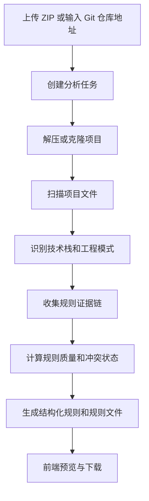

# Asgis AI

Asgis AI 是一个面向前端工程的 AI Coding Rules 生成工具。它可以从 ZIP 项目或 Git 仓库中扫描工程结构，识别技术栈、目录组织、API 调用、状态管理、路由权限、组件封装等工程模式，并生成可用于 Cursor / Cline 的规则文件。

当前版本采用轻量级规则分析方案，主要基于文件结构、文本扫描、正则匹配和证据链统计，不依赖 AST、Agent 编排或自动改代码能力。目标是先把“项目规范识别、证据展示、规则生成、规则下载”这条链路做稳定。

## 核心能力

- 支持 ZIP 项目上传分析
- 支持 GitHub / Gitee HTTPS 仓库导入分析
- 支持任务进度、阶段和错误状态展示
- 自动识别 Vue、React、uni-app、Taro、小程序等前端项目类型
- 自动识别 TypeScript、UI 组件库、状态管理、路由、构建工具等技术栈
- 生成结构化规则列表
- 生成规则证据链，包含来源文件、命中代码、命中特征、命中次数和置信度
- 提供规则质量评分、稳定性评分、一致性评分、冲突检测和建议说明
- 预览并下载 `rules.md`、`development-flow.md`、`.clinerules`、`cursor-rules.md`
- 支持上传大小、Git clone 超时、仓库大小和历史任务清理配置

## 规则输出

分析完成后会生成 4 个规则文件：

| 文件 | 说明 |
| --- | --- |
| `rules.md` | 项目工程规范总览，包含技术栈、工程约束、规则分类和开发要求 |
| `development-flow.md` | 面向 AI Coding 的开发流程入口，说明开发时应如何引用规则 |
| `.clinerules` | 面向 Cline 的执行约束 |
| `cursor-rules.md` | 面向 Cursor 的代码生成与补全约束 |

结构化规则当前覆盖：

- 项目结构规则
- API 调用规则
- 组件封装规则
- 状态管理规则
- 路由与权限规则
- 样式与命名规则

其中 API、组件、状态管理、路由规则已经接入证据链与质量评估。

## 规则数据结构

接口返回的结构化规则包含以下核心字段：

```json
{
  "id": "api-call-001",
  "category": "API 调用规则",
  "title": "统一通过请求封装调用接口",
  "description": "页面和组件不应直接发起请求。",
  "level": "important",
  "content": "新增接口必须放入已有 API 目录，并复用统一请求封装。",
  "evidence": [
    {
      "file": "src/api/utils/request.ts",
      "line": 12,
      "snippet": "const service = axios.create({"
    }
  ],
  "matched_patterns": ["src/api", "request.ts", "axios.create"],
  "match_count": 17,
  "confidence": 0.6,
  "quality_score": 60,
  "stability_score": 100,
  "consistency_score": 60,
  "conflict_detected": false,
  "conflict_reason": null,
  "recommendation": "规则具备一定证据，建议作为重要参考并结合相邻文件确认。"
}
```

## 技术栈

前端：

- Vue 3
- TypeScript
- Vite
- Element Plus
- Axios

后端：

- Python
- FastAPI
- Pydantic
- GitPython
- 本地文件存储

可选能力：

- OpenAI SDK compatible mode
- Qwen 兼容接口配置

当前规则分析默认使用确定性 Pattern Analysis，不需要配置大模型密钥也可以运行核心流程。

## 系统流程



## 项目结构

```text
backend/
  app/
    main.py
    config.py
    models/
      error_model.py
      rule_model.py
      task_model.py
    routes/
      config.py
      repo.py
      rules.py
      status.py
      tasks.py
      upload.py
    services/
      analysis_task_service.py
      cleanup_service.py
      evidence_collector_service.py
      pattern_analyzer_service.py
      pattern_matcher_service.py
      project_service.py
      repo_service.py
      rules_generator_service.py
      scan_service.py
      task_db_service.py

frontend/
  src/
    api/
      task.ts
    components/
      DownloadPanel.vue
      ProjectImportPanel.vue
      RulePreviewTabs.vue
      TaskProgressPanel.vue
      TechStackPanel.vue
    types/
      task.ts
    utils/
      stageMap.ts
    views/
      HomeView.vue
```

## 本地运行

### 后端

```bash
cd backend
python -m venv .venv
```

Windows：

```bash
.venv\Scripts\activate
pip install -r requirements.txt
uvicorn app.main:app --reload --host 127.0.0.1 --port 8001
```

macOS / Linux：

```bash
source .venv/bin/activate
pip install -r requirements.txt
uvicorn app.main:app --reload --host 127.0.0.1 --port 8001
```

健康检查：

```bash
curl http://127.0.0.1:8001/health
```

### 前端

```bash
cd frontend
npm install
npm run dev
```

默认后端地址：

```text
http://127.0.0.1:8001
```

如需修改后端地址，可以配置环境变量：

```env
VITE_API_BASE_URL=http://127.0.0.1:8001
```

## 后端配置

可在 `backend/.env` 中配置运行参数，字段参考 `backend/.env.example`。

```env
DASHSCOPE_API_KEY=
QWEN_BASE_URL=https://dashscope.aliyuncs.com/compatible-mode/v1
QWEN_MODEL=qwen-plus

ASGIS_MAX_UPLOAD_MB=100
ASGIS_MAX_REPO_MB=200
ASGIS_CLONE_TIMEOUT_SECONDS=180
ASGIS_TASK_RETENTION_DAYS=7
ASGIS_TASK_RETENTION_MAX_COUNT=100
```

配置说明：

- `ASGIS_MAX_UPLOAD_MB`：ZIP 上传大小限制，单位 MB
- `ASGIS_MAX_REPO_MB`：Git 仓库 clone 后目录大小限制，单位 MB
- `ASGIS_CLONE_TIMEOUT_SECONDS`：Git clone 超时时间，单位秒
- `ASGIS_TASK_RETENTION_DAYS`：历史任务保留天数
- `ASGIS_TASK_RETENTION_MAX_COUNT`：最多保留任务数量

## 常用接口

### 上传 ZIP

```http
POST /api/tasks/upload
```

表单字段：

```text
file: 项目 zip 文件
```

### 导入 Git 仓库

```http
POST /api/tasks/git
```

请求体：

```json
{
  "git_url": "https://gitee.com/org/repo",
  "access_token": "可选，私有仓库 Token"
}
```

### 查询任务状态

```http
GET /api/tasks/{task_id}
```

任务状态：

- `queued`
- `running`
- `success`
- `failed`

任务阶段：

- `uploading`
- `cloning`
- `scanning`
- `analyzing`
- `generating`
- `packaging`
- `done`
- `error`

### 查询分析结果

```http
GET /api/tasks/{task_id}/result
```

### 下载规则包

```http
GET /api/tasks/{task_id}/download
```

下载包包含：

- `rules.md`
- `development-flow.md`
- `.clinerules`
- `cursor-rules.md`

### 清理历史任务

```http
POST /api/tasks/cleanup
```

可选参数：

```text
retention_days=7
max_count=100
```

## 识别范围

项目类型：

- Vue
- React
- uni-app
- Taro
- 原生小程序

工程模式：

- API：`src/api`、`request.ts`、`request.get`、`request.post`、`axios.create`
- 状态管理：`defineStore`、`useXxxStore`、`src/store`、`src/stores`
- 路由：`src/router`、`createRouter`、`beforeEach`、`meta`、`permission`
- 组件：`src/components`、`components/`、`Base*.vue`、`common/shared/base` 目录
- 权限：`permission.ts`、`auth.ts`、`hasPermission`、路由守卫、登录相关文件

## 验证方式

```bash
cd frontend
npm run build
```

```bash
cd ..
python -m compileall backend/app
```

也可以使用 `sample-data/vue3-admin-sample` 作为测试项目，验证上传、分析、规则预览和规则下载流程。

## 当前边界

当前版本不实现：

- AST 深度解析
- Agent 自动编排
- 自动修改代码
- 自动提交 PR
- 自动生成业务页面
- 复杂代码依赖图分析

这些能力可以作为后续阶段扩展。当前版本优先保证规则识别链路稳定、可解释、可展示、可部署。
